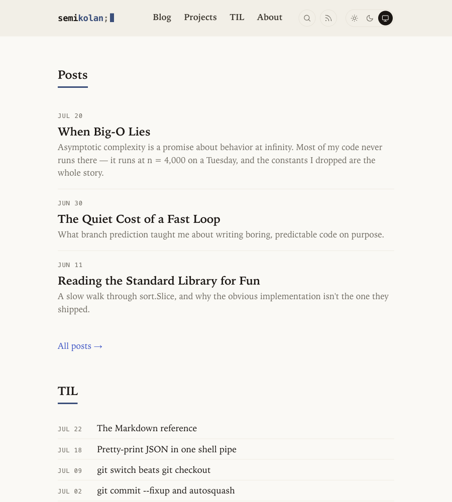
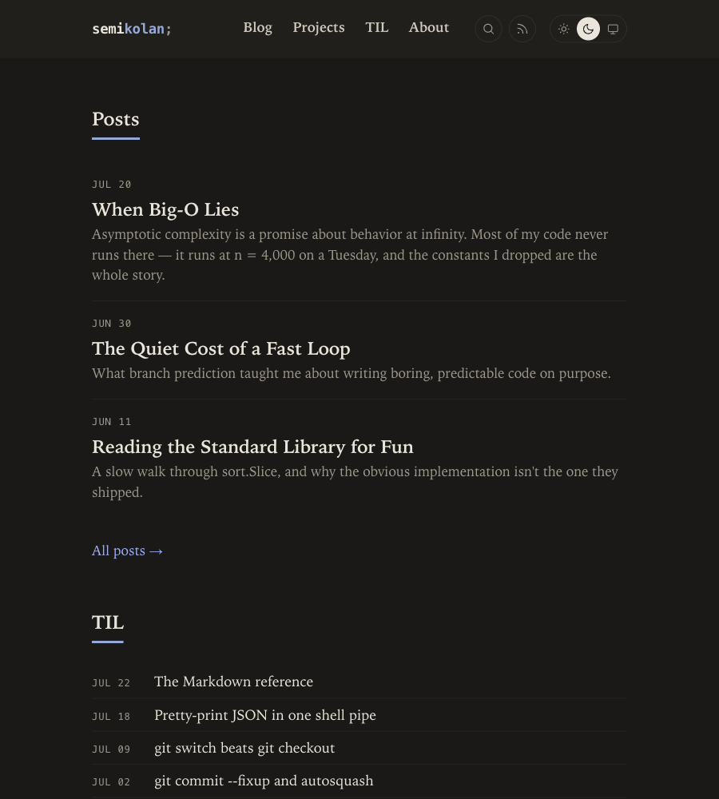
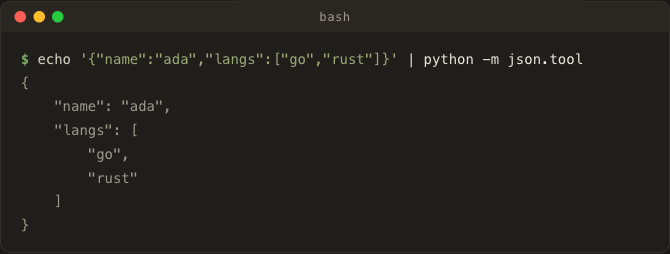
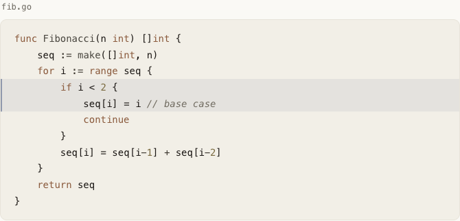
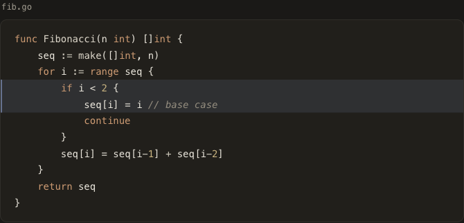
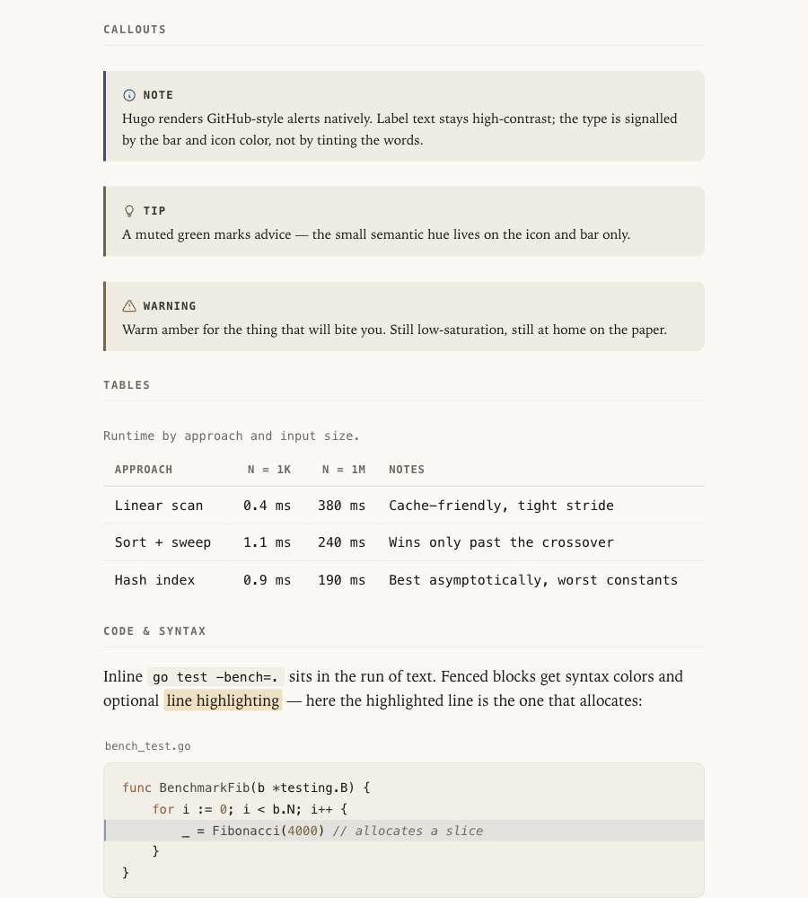
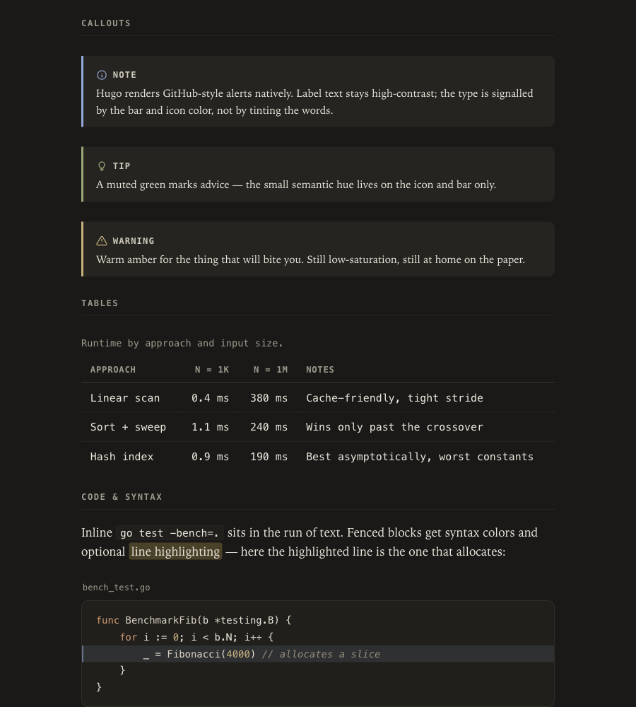

# semikolan

Personal site of **Abhilash Kolanthara** (**[semikolan.dev](https://semikolan.dev)**) — notes on tech, AI, systems, and whatever's nagging at me.

Built with [Hugo](https://gohugo.io/) and a small, hand-built theme (no external theme dependency). Warm-paper + ink-indigo design system, light / dark / system themes, and a Markdown pipeline with a few custom conveniences (terminal blocks, callouts, copy buttons).

<table>
  <tr>
    <td width="50%"></td>
    <td width="50%"></td>
  </tr>
  <tr>
    <td align="center"><sub>Landing · light</sub></td>
    <td align="center"><sub>Landing · dark</sub></td>
  </tr>
</table>

## Stack

- **Hugo** `0.146+` (extended edition **not** required; built and verified on `0.164.0`)
- First-party theme: layouts in `layouts/`, styles in `assets/css/main.css`
- Client-side search (dependency-free), RSS + JSON output
- Deploys on **Cloudflare Pages**

## Local development

```bash
hugo server        # dev server with live reload → http://localhost:1313
hugo server -D     # include drafts
hugo --minify      # production build into ./public
```

## Project structure

```
content/            Markdown content (sections map to URL paths)
  blog/             Posts
  til/              Today-I-Learned notes
  projects/         Projects (driven by front matter in _index.md)
  about/            About page
  reading-list.md   Standalone pages (linked from About)
  tools-i-use.md
layouts/            Templates (baseof, index, single, list, partials)
  _default/_markup/ Render hooks (code blocks, tables, headings)
  shortcodes/       callout.html
assets/css/main.css Single-file design system (CSS custom properties)
static/             Favicons, social image, manifest, robots.txt
hugo.toml           Site config (menus, outputs, taxonomies, markup)
```

## Authoring content

### A blog post or TIL

Create `content/blog/my-post.md` (or `content/til/…`):

```markdown
---
title: "My Post"
description: "One-line summary — also used as the social/meta description."
date: 2026-07-27
tags: ["go", "performance"]
---

Body in Markdown…
```

### Projects

Edit the `projects` list in `content/projects/_index.md`:

```yaml
projects:
  - name: "flowtrace"
    desc: "A low-overhead request tracer for Go services."
    href: "https://example.com"      # optional → "live" link
    repo: "https://github.com/…"      # optional → "source" link
    tech: ["Go", "eBPF"]
    year: "2026"
```

## Markdown features

Beyond standard Markdown, the theme adds:

**Code blocks** — syntax highlighting, an optional filename caption, and line highlighting:

````markdown
```go {file="fib.go" hl_lines="4-5"}
func Fibonacci(n int) []int { … }
```
````

**Terminal windows** (opt-in) — a mac-style dark window with traffic lights and a copy button:

````markdown
```bash {term=true}
curl -s https://api.example.com/thing | python -m json.tool
```
````

Use the `console` language to show a command **and** its output (the `$` prompt is highlighted, output dimmed; the copy button copies only the command):

````markdown
```console {term=true}
$ hugo --gc
Total in 84 ms
```
````

**Callouts** — `note`, `tip`, or `warn`:

```markdown

Body supports **Markdown**.

```

**Diagrams** — a fenced ` ```mermaid ` block renders client-side, themed to the palette.

**Math** — write MathML directly (Goldmark passthrough is enabled).

Every code block gets a **copy button**, and footnote back-arrows get a tooltip. There's a live reference at **`/til/markdown-reference/`** exercising all of it.

### Rendered examples

Opt-in **terminal window** — mac chrome, copy button, and a `console` mode that highlights the prompt and dims output (always dark by design):

<p></p>

**Syntax-highlighted code** with a filename caption and line highlighting:

<table>
  <tr>
    <td width="50%"></td>
    <td width="50%"></td>
  </tr>
  <tr><td align="center"><sub>light</sub></td><td align="center"><sub>dark</sub></td></tr>
</table>

**Callouts** — note / tip / warning:

<table>
  <tr>
    <td width="50%"></td>
    <td width="50%"></td>
  </tr>
  <tr><td align="center"><sub>light</sub></td><td align="center"><sub>dark</sub></td></tr>
</table>

## Design & theme

- All colors/spacing are CSS custom properties in `assets/css/main.css` (`--paper`, `--ink`, `--clay`, `--serif`, `--mono`, …).
- **Light / Dark / System** switch in the header; System is the default and follows the OS.
- Responsive down to 320px; the nav collapses into a menu on mobile (theme switch stays visible).

## Deployment (Cloudflare Pages)

Connected via Git integration. On every push, non-production branches get an automatic **preview deployment**; merging to `main` deploys production.

| Setting | Value |
|---|---|
| Production branch | `main` |
| Build command | `hugo` |
| Build output directory | `public` |
| `HUGO_VERSION` (Production **and** Preview) | `0.164.0` |

`baseURL` is set to the production domain in `hugo.toml`, so canonical/OpenGraph URLs resolve correctly.

## License

Content is licensed under [CC-BY-SA 4.0](https://creativecommons.org/licenses/by-sa/4.0/) (copyleft — share alike). The site code (layouts, CSS) is free to reuse.
